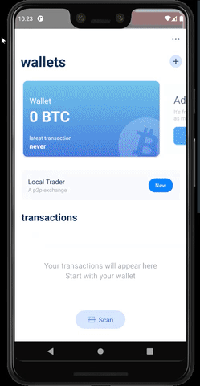

# Extra (DNA) Layer - a bitcoin wallet base on biometric protection
---
####  ⚠🛑THIS IS A PROOF OF CONCEPT - PLEASE DO NOT USE IT FOR STORING REAL BITCOINS 🛑⚠ 

A Thin Bitcoin Wallet.
Built with React Native and Electrum, Based on the popular [BlueWallet](www.bluewallet.io).

---




## Build Instructions

* In your console:

```
git clone https://github.com/kaminskypavel/dna-layer-bluewallet
cd dna-layer-bluewallet
yarn
```


### Setup Mnemonic-DNA Server 

First, lets build the client recorder and verifier 
```
1. cd mnemonic-dna
2. yarn
3. yarn start
```

Now, lets build the server  
```
1. cd mnemonic-dna/server
2. yarn
3. yarn start
```
### Build Clients

* Proxy 
for development purposes, 
make sure ports 3000 and 8081 are proxied to your local PC

```$ proxy.bat ```

* Android

```
npx react-native run-android
```

* To run on iOS:

```
npx pod-install
npm start
```

In another terminal window within the BlueWallet folder:
```
npx react-native run-ios
```


## MOTIVATION TO BUILD IT

I was not satisfied with existing iOS Bitcoin apps, especially with BreadWallet (the one I mainly used) where development stalled and they could not even deliver such features as SegWit, RBF and custom fees (at the times where custom fees were especially needed).
So I knew I could create one to use myself and let others use it.
I had experience with awesome bitcoin-js lib (javascript), and since I dont own any Macs, don't plan to and not going to learn ObjC/Swift - ReactNative (where you also write in javascript) was an obvious choice.


## LICENSE

MIT

## RESPONSIBLE DISCLOSURE
This is a proof-of-concept, I take no responsibility if you decide to store your coins here
